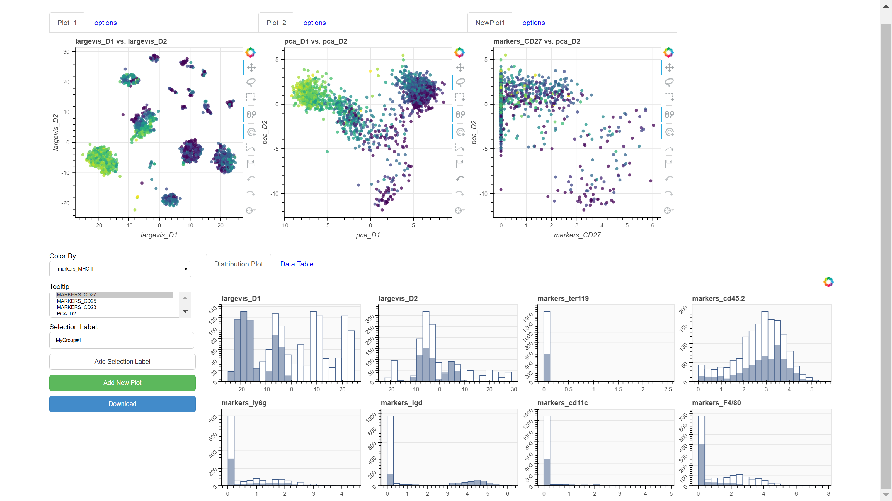

# Scalable Visualization for High-dimensional Single-cell Data

## Project Description
Publication and Code Repo for [PSB 2017](http://psb.stanford.edu/) submission.
Single-cell analysis can uncover the mysteries in the state of individual cells and enable us to construct new models about the analysis of heterogeneous tissues. State-of-the-art technologies for single-cell analysis have been developed to measure the properties of single-cells and detect hidden information. They are able to provide the measurements of dozens of features simultaneously in each cell. However, due to the high-dimensionality, heterogeneous complexity and sheer enormity of single-cell data, its interpretation is challenging. Thus, new methods to overcome high-dimensionality are necessary. Here, we present a computational tool that allows efficient visualization of high-dimensional single-cell data onto a low-dimensional (2D or 3D) space while preserving the similarity structure between single-cells. Using this approach, we can preserve the high-dimensional structure of single-cell data in an embedded low-dimensional space that facilitates visual analysis of the data.

## Visualization Tool Demo
(click image for video demo)

## Project Overview
+ [Main](../Main/) 
    + Implementation of LargeVis
+ [Visualization](../Visualization/)
    + Bokeh application developed to assist visual exploration of the data
+ [Experiments](../Experiments/)
    + Code for reproducing empirical results shown in paper
+ [Install](../Install/)
    + Scripts and instructions to aid in installing dependencies

### License
[MIT license](LICENSE)

#### Authors
+ Juho Kim, juhokim2@illinois.edu 
+ Nate Russell, ntrusse2@illinois.edu 
+ Jian Peng, jianpeng@illinois.edu 
